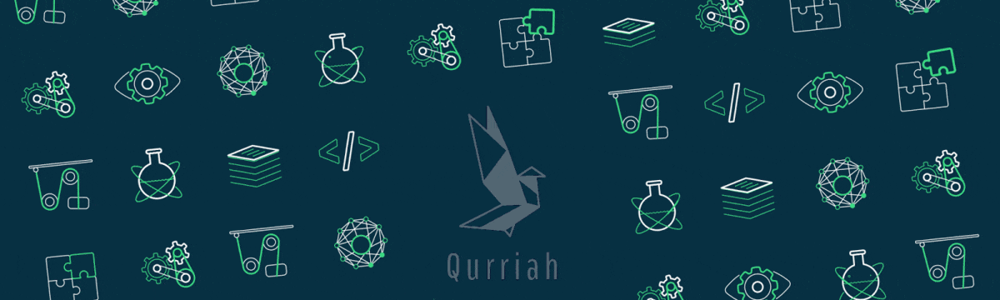

# Hi there, I am Sam Kuria 

 
 

&nbsp;

- 🌱 Currently learning: [Jest](https://jestjs.io/)
- ⛏ Contributing to: [elewa](https://github.com/italanta/elewa)

## 💻 Technologies I Work With

## 🎨 Dev & Design Tools

## 📱 Alogrithims practice

## ⌨️ My Setup

&nbsp;

## 📊 GitHub Stats

<!--
  

    
  

-->

  

