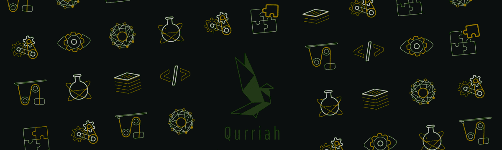
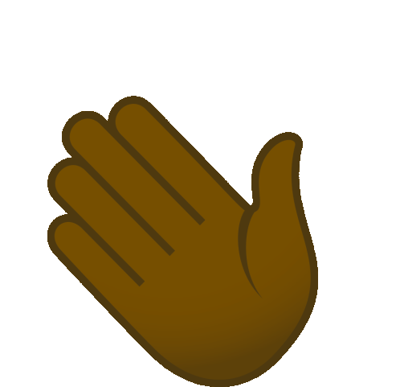

# Hi there, I am Sam Kuria 

<!--  -->

 

<!-- &nbsp; -->

🌱 Currently learning: [Jest](https://jestjs.io/)
 
⛏ Contributing to: [elewa](https://github.com/italanta/elewa)

## 💻 Technologies I Work With

## 📱 Alogrithims practice

&nbsp;

## 📊 GitHub Stats

<!--   

    
  
 -->

  
  <!--  -->
     
  <!-- &layout=donut -->

<!--  -->
